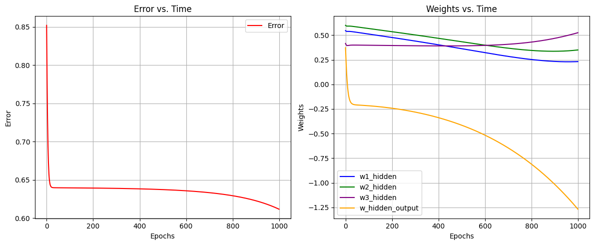

# 🧠 Two-Layer Neural Network from Scratch (NumPy)

This project implements a **basic feedforward neural network** with **manual backpropagation** using only NumPy — no machine learning libraries like TensorFlow or PyTorch.

It trains on a small 3-input dataset and visualizes:
- Error vs Epochs
- Weight changes over time

<br>

## 🔧 Features
- Sigmoid activation function
- Manual forward & backward pass
- Weight updates using gradient descent
- Tracks and plots:
  - Error curve
  - Weight updates per epoch

<br>

## 📈 Visual Output

### 🟥 Error vs. Epochs & 🟧 Weight Evolution


<br>

## 🧪 Example Dataset
```python
X = np.array([
  [0.1, 0.1, 1],
  [0.1, 0.9, 1],
  [0.9, 0.1, 1],
  [0.9, 0.9, 1]
])

t = np.array([0.1, 0.9, 0.9, 0.1])  # Target outputs
This mimics an XOR-like structure with a bias input already included (last column).

<br>
🚀 Getting Started
1. Clone the repository
bash
Copy
Edit
git clone https://github.com/your-username/two-layer-neural-net-numpy.git
cd two-layer-neural-net-numpy
2. Install requirements
bash
Copy
Edit
pip install -r requirements.txt
3. Run the model
bash
Copy
Edit
python two_layer_nn.py
<br>
📁 Files
two_layer_nn.py – main script with model, training, and plotting

requirements.txt – required Python packages

README.md – project documentation

<br>
📚 Concepts Covered
Feedforward neural networks

Sigmoid activation & derivative

Backpropagation

Weight updates via gradient descent

Loss tracking and visualization

<br>
📄 Lic
